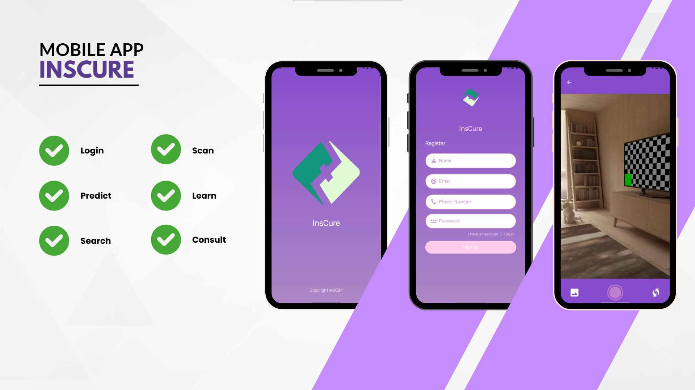
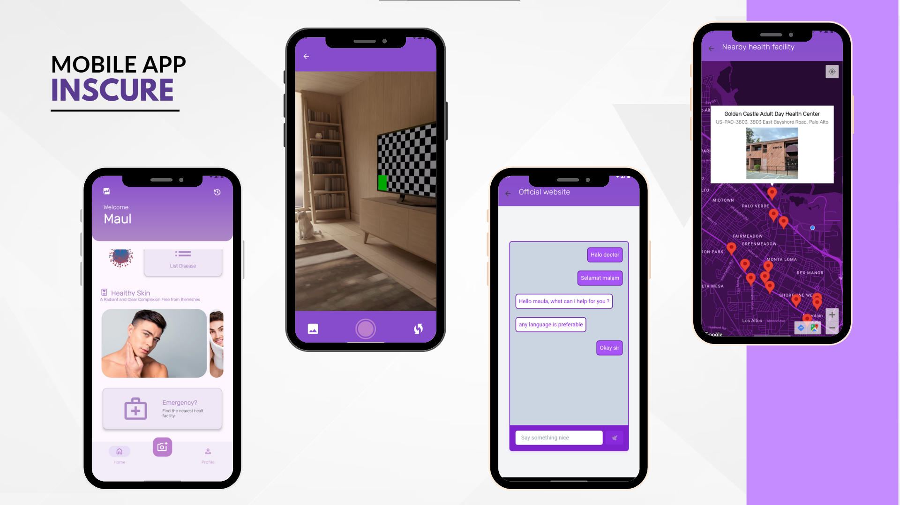

<h1 align='center'> Hi there 👋, We are from InsCure! </h1>

InsCure is an innovative web application designed to provide accurate predictions for skin diseases using advanced machine learning models.

With just a simple image upload, users can receive fast and reliable predictions about various skin conditions, helping them take proactive steps towards their health.

#### Get to Know Us

| Name                     |      ID      | Path |               Kampus                |                      Github                       |
| ------------------------ | :----------: | :--: | :---------------------------------: | :-----------------------------------------------: |
| Ammar Muhammad Zikra     | M312D4KY1649 |  ML  |      Universitas Sebelas Maret      |     [ammar123t](https://github.com/ammar123t)     |
| Dionisius Indra Raditya  | M312D4KY2201 |  ML  |      Universitas Sebelas Maret      |      [IndraR26](https://github.com/IndraR26)      |
| Muhamad Bintang Ramadhan | M312D4KY2615 |  ML  |      Universitas Sebelas Maret      |    [BintangGod](https://github.com/BintangGod)    |
| Muhammad Rafi Sutrisno   | C004D4KY1000 |  CC  | Institut Teknologi Sepuluh Nopember | [Rafi-Sutrisno](https://github.com/Rafi-Sutrisno) |
| Ahda Filza Ghaffaru      | C004D4KY1020 |  CC  | Institut Teknologi Sepuluh Nopember |        [Ahdaaa](https://github.com/Ahdaaa)        |
| Maula Syabil Haqq        | A012D4KY4181 |  MD  |         Universitas Telkom          |     [Sh1rush1i](https://github.com/Sh1rush1i)     |
| Bagas Putra Pratama      | A012D4KY4189 |  MD  |         Universitas Telkom          |   [bagasputrap](https://github.com/bagasputrap)   |

#### Inscure App Preview

Access our web via [InsCure](http://apt-entropy-275011.et.r.appspot.com/)

#### Our Repositories

| Path |                                   Github Repository                                   |
| :--: | :-----------------------------------------------------------------------------------: |
|  ML  |       [InsCure Machine Learning](https://github.com/Ins-Cure/Machine-Learning)        |
|  MD  |     [InsCure Mobile Development](https://github.com/Ins-Cure/Mobile-Development)      |
|  CC  |       [InsCure CC Backend](https://github.com/Ins-Cure/Cloud-Computing-backend)       |
|  CC  |      [InsCure CC Frontend](https://github.com/Ins-Cure/Cloud-Computing-frontend)      |
|  CC  | [InsCure CC Model Handler](https://github.com/Ins-Cure/Cloud-Computing-model-handler) |

#### Documentation

- [Our Video Presentation](https://)

#### Dataset

- [Skin Diseases Dataset 1](https://www.kaggle.com/datasets/subirbiswas19/skin-disease-dataset)
- [Skin DIseases Dataset 2](https://www.kaggle.com/datasets/ismailpromus/skin-diseases-image-dataset)

#### Deployments

- [InsCure APK Release](https://github.com/Ins-Cure/Mobile-Development/releases)
- [InsCure Web Application](http://apt-entropy-275011.et.r.appspot.com/)
- [Postman API Documentation](https://documenter.getpostman.com/view/25927897/2sA3XV7eCN)
<!--

**Here are some ideas to get you started:**

🙋‍♀️ A short introduction - what is your organization all about?
🌈 Contribution guidelines - how can the community get involved?
👩‍💻 Useful resources - where can the community find your docs? Is there anything else the community should know?
🍿 Fun facts - what does your team eat for breakfast?
🧙 Remember, you can do mighty things with the power of [Markdown](https://docs.github.com/github/writing-on-github/getting-started-with-writing-and-formatting-on-github/basic-writing-and-formatting-syntax)
-->
